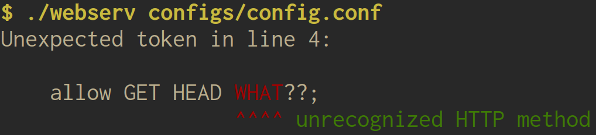

# Alrik Neumann

Software developer focused low level C programming.
Currently completing the program at [42 Berlin](https://42berlin.de/), a peer-reviewed, project-only curriculum without teachers but a lot of self-directed learning.

  

**Open to junior roles in systems, embedded systems or backend with C or C++ · based in Berlin, available immediately for full-time positions**

## Languages

German (native) · English (fluent) · French, Spanish, Chinese (basic)

## Projects

### [FWL - FIFO Word Logger](https://github.com/alneuma/fwl_kernel_module)

       

> **What this is:** A loadable kernel module implementing a character device for Linux 6.12.105\
> **Context:** exercise\
> **Dev time:** ~2.5 weeks, including environment setup and research\
> **Team size:** solo

What looks deceptively simple turns into a hog of complexity when taken seriously: write words to a queue, read them back, do some periodic logging. What could possibly go wrong?

Concepts:
- Managing partial failures
- Transactional state mutations
- Per-open-file-description state
- Resource accounting
- Defining lock order
- Counteracting timer drift
- Clarifying under-specified semantics
- Dealing with asynchronous data mutations that invalidate shared state

The README walks through every semantics decision, many implementation details, and states plainly what was tested and what wasn't.

### [Webserv](https://github.com/jhelbig42/webserv)

   

> **What this is:** An HTTP server built from scratch: No third party libraries\
> **Context:** school project\
> **Dev time:** several months\
> **Team size:** 3\
> **Role:** developer

A small functional webserver based on HTTP/1.0.

Features:
- GET, HEAD, POST and DELETE methods
- CGI
- Connection management with `poll()`
- A non-blocking event loop with partial-request handling
- Serving different websites on different interface/port pairs
- Extensive configuration options

My contributions:
- Co-developed the overall architecture
- Template-based multi-level logging system
- A well-documented buffer class as essential infrastructure for other parts of the program
- An expandable, well-documented config-parser that emits descriptive error messages
- Most LOC (I know, not a quality metric)

webserv config error

### [Minishell](https://github.com/alneuma/minishell)

 

> **What this is:** A small Unix shell\
> **Context:** school project\
> **Dev time:** several months\
> **Team size:** 2\
> **Role:** project lead

A mini shell, not a mini project

Features:
- Interactive prompt integrating GNU Readline
- Signal handling, adjusted per context (prompt, heredoc, child processes)
- Shell and environment variables, expansion and `$?`
- PATH resolution
- Redirection with `<`, `>` and `>>`
- Heredocs
- Quoting semantics for `"` and `'`
- Limited globbing with `*`
- Arbitrary pipe chains `a | b | c`
- Control operators `&&`, `||` and `()` for grouping/precedence only
- Handling of syntactically invalid input, pointing out the first offending token
- Several shell built-ins: `echo -n`, `pwd`, `cd`, `export`, `unset`, `exit`

My contributions:
- Designed the entire architecture
- Drove the implementation end-to-end in daily pairing with my partner

## How I work

- Writing code is how I organize my thoughts.
- Some challenges are still best solved off screen.
- Deep-diving into unfamiliar territory and complex challenges is what I love best.
- After every idea for how to make it work, ask: what could go wrong?
- Almost daily peer code reviews at my school. We all mentor each other.

## AI usage

- locating documentation
- clarifying unfamiliar APIs
- reviewing written code
- probing for failure cases

I don't let AI write the code. Designing an architecture and implementing it myself is the fun part.
